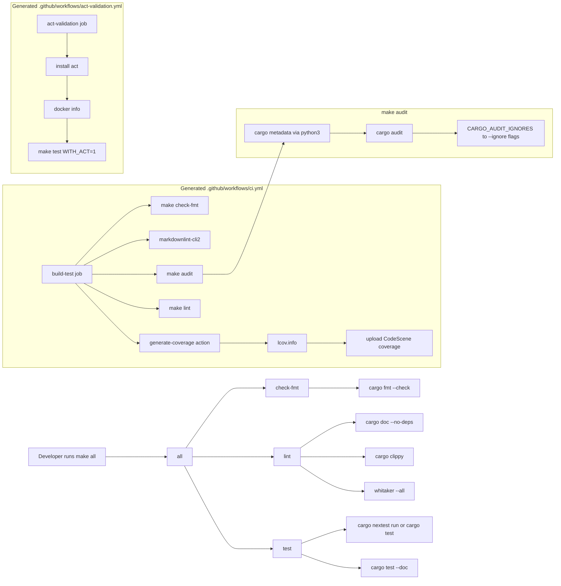

# agent-template-rust

This repository provides a [Copier](https://copier.readthedocs.io/) template for
starting new Rust projects. Running Copier with this template generates a fresh
crate preconfigured with sensible defaults and continuous integration.

The template requires **Copier 9.0** or later to avoid incompatibilities.

## How to use

1. Install Copier 9.0 or later: `pip install copier`.
2. Run `copier copy gh:leynos/agent-template-rust <destination>`.
3. Fill in the prompts for project, crate, license, and nightly toolchain date.
4. Change into the created directory and start coding.

## What you get

- **Cargo setup** using the 2024 edition and Clippy's pedantic lint level
  enabled【F:template/Cargo.toml†L1-L9】.
- **Pinned toolchain** file specifying a configurable nightly release
  【F:template/rust-toolchain.toml.jinja†L1-L3】.
- **Project metadata prompts** for repository URL, homepage, crates.io keywords,
  crates.io categories, nightly date, and optional Linux development target.
- **Fast generated tooling** including Cranelift debug code generation, Linux
  `mold` linking for development builds, cargo-nextest tests with a cargo-test
  fallback, Whitaker linting, and a lld-backed coverage target.
- **Starter code** providing either a binary entry point or a library
  function depending on flavour【F:template/src/main.rslib.rs.jinja†L1-L10】.
- **GitHub CI workflow** that formats, lints, tests, and uploads
  coverage metrics to CodeScene【F:template/.github/workflows/ci.yml†L1-L35】.
- **Release workflow** for cross-platform binaries when the app flavour is used
  【F:template/.github/workflows/release.yml.jinja†L1-L114】.
- **Markdownlint** configuration applying consistent line length rules
  【F:template/.markdownlint-cli2.jsonc†L1-L11】.
- **Codecov settings** requiring 80% patch coverage and a small project
  threshold【F:template/codecov.yml†L1-L8】.
- **ISC license template** ready for your details【F:template/LICENSE†L1-L9】.
- **Starter README** referencing Copier for regeneration【F:template/README.md†L1-L3】.

Use this template when you need a minimal scaffold for CLI tools or small
utilities. The included workflow ensures coverage metrics are collected and
linters run from the very first commit.

## Testing

Run the parent template tests through the repository `Makefile`. Run
`make help` to list the available parent Makefile targets. The `test` target
uses `uvx` to provide `pytest-copier`, `PyYAML`, `syrupy`, and `make-parser`
without a manually managed virtual environment:

```bash
make test
```

Optional local GitHub Actions validation is gated behind `WITH_ACT=1` and
requires `act` plus a Docker-compatible container runtime:

```bash
make test WITH_ACT=1
```

Parent and generated-project CI run this mode in a separate
`act-validation.yml` workflow, so container-backed workflow checks run in
parallel with the normal test and coverage workflow.

## Generated Quality Gate Flow

Figure: The generated `make all` quality gate verifies formatting, linting, and
tests. The main generated CI workflow also runs the audit and coverage targets;
the separate Act validation workflow runs the parent template tests with
`WITH_ACT=1` so rendered workflow checks do not slow the main CI path.



Additional details are in [`docs/testing.md`](docs/testing.md).

User-facing generated-project behaviour is documented in
[`docs/users-guide.md`](docs/users-guide.md). Parent-template development
requirements are documented in
[`docs/developers-guide.md`](docs/developers-guide.md).
