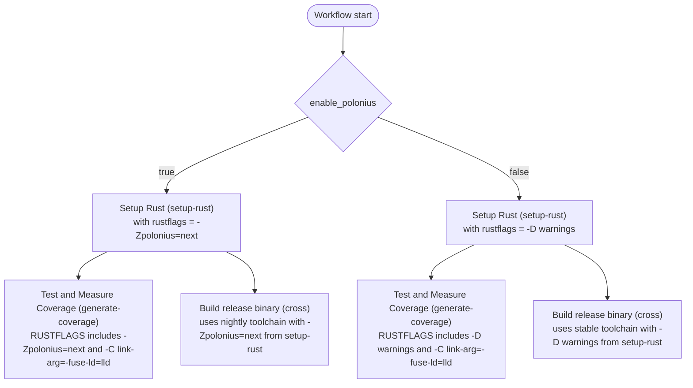

# User Guide

This repository is a Copier template for creating Rust projects. The generated
project is intended to be usable immediately after rendering.

## Copier Prompts

The template asks for normal project identity values such as project name,
package name, licence holder, and contact email. It also asks for package
metadata used in the generated `Cargo.toml`:

- `flavour` selects `lib` or `app` and determines the generated structure and
  release metadata.
- `enable_polonius` enables the nightly Polonius borrow checker
  (`-Zpolonius=next`). It defaults to enabled for applications, where
  borrow-centric internal APIs can evolve with the project, and disabled for
  libraries, which commonly need wider compiler compatibility. Either default
  can be overridden. Existing projects should follow the
  [0.2.0 migration guide](migrations/0.2.0.md) when adopting this prompt.
- `package_description` becomes `[package].description`.
- `repository_url` becomes `[package].repository` and is used by generated
  app projects for cargo-binstall release URLs.
- `homepage_url` becomes `[package].homepage`.
- `package_keywords` becomes `[package].keywords`.
- `package_categories` becomes `[package].categories`.
- `rust_nightly_date` selects the pinned nightly toolchain date.
- `license_year` sets the copyright year in `LICENSE`.
- `dev_target` selects the target-specific Linux linker block generated in
  `.cargo/config.toml`.
- `codescene_project_id` is the CodeScene project id for the coverage gate. It
  defaults to empty, and every CodeScene step degrades gracefully while it is
  unset: the guarded upload in `coverage-main.yml` skips without a token, and
  the pull-request workflow leaves the changed-line `mode: check` gate deferred
  in a documented comment. Fill it in (and set the `CS_ACCESS_TOKEN` secret)
  once the repository is onboarded to CodeScene.

## Generated Tooling

Generated projects use Rust 2024, a pinned nightly toolchain, strict lint
settings, and documented starter code. Library projects render `src/lib.rs`.
Application projects render `src/main.rs`, `src/lib.rs`, release automation, and
`[package.metadata.binstall]` metadata for binary installation.

When Polonius is enabled, the generated Cargo configuration, Makefile, coverage
workflows, and application release workflow preserve `-Zpolonius=next`. The
Linux target-specific `mold` flags repeat it because Cargo selects target
rustflags instead of merging them with `[build].rustflags`. The generated
project also includes `docs/polonius.md` and matching `AGENTS.md` guidance for
borrow-centric APIs.

Generated CI and coverage workflows, plus the release workflow rendered for
applications, pass their base compiler flags through the shared `setup-rust`
action's `rustflags` input. They pass
`-Zpolonius=next` when Polonius is enabled and retain `-D warnings` otherwise;
coverage steps then repeat that base alongside their `lld` linker flag when
they override `RUSTFLAGS`. The pinned shared-action revision must expose this
input, so dependency updates must preserve the passthrough contract.

For screen readers: The following flowchart shows how `enable_polonius`
selects the base Rust flags used by setup and coverage workflows, and by the
release workflow rendered for applications (library renders omit
`release.yml`).
The enabled path uses `-Zpolonius=next`; the disabled path uses `-D warnings`.
Coverage adds the `lld` linker flag to either base, while release inherits the
selected base from `setup-rust` and uses the corresponding nightly or stable
toolchain.

_Figure 1: Rust flag selection and propagation through generated setup and
coverage workflows, and the application-only release workflow._

Development builds use Cranelift for debug code generation. On Linux targets,
`.cargo/config.toml` configures clang to link with `mold` so local debug builds
link quickly. Coverage generation uses `lld` instead because LLVM coverage
tools expect LLVM-compatible linker behaviour.

## Validation and Environment Policy

Generated manifests deny `unknown_lints`, `renamed_and_removed_lints`,
`unsafe_code`, and `missing_docs`. Rustdoc denies
`missing_crate_level_docs`, `broken_intra_doc_links`,
`private_intra_doc_links`, `bare_urls`, `invalid_html_tags`,
`invalid_codeblock_attributes`, and `unescaped_backticks`. Clippy denies
`missing_assert_message` and uses `disallowed_methods` to reject direct calls
to process-environment readers, iterators, and mutation functions. Warnings are
validation failures; these policies are not advisory.

Code that depends on environment variables must receive `mockable::Env` (or a
narrow equivalent closure) as a dependency. The production composition root
constructs `mockable::DefaultEnv`, while tests use `mockable::MockEnv`.
In-process tests must not mutate the process environment or serialize mutation
behind `Mutex`, `OnceLock`, or `serial_test`. The only mutation exception is an
end-to-end test using `assert_cmd`: `Command::env` and `Command::env_clear`
configure the isolated child process, not the test harness.

`make lint` builds documentation with Rustdoc warnings denied before running
Clippy and Whitaker. `make test` exports warning-denial flags to the selected
test runner and separately runs all-feature workspace doctests with Rustdoc
warnings denied. A warning from normal tests, the documentation build, or a
doctest therefore fails the command.

### Migrate an Existing Generated Project

1. Copy the current `[lints.clippy]`, `[lints.rust]`, and `[lints.rustdoc]`
   policy into each package manifest, or opt every workspace member into
   equivalent workspace lints.
2. Add the current `disallowed-methods` entries to the workspace-root
   `clippy.toml`.
3. Update the generated Makefile so `make lint` passes mandatory
   `RUSTDOCFLAGS` to `cargo doc` and `make test` passes them to workspace
   doctests. Preserve mandatory flags when appending inherited flags.
4. Declare the current `mockable` dependency, refactor direct `std::env` reads
   behind an injected `mockable::Env`, and replace in-process environment
   mutation with `mockable::MockEnv`. Wire the environment adapter at the
   composition root and construct `mockable::DefaultEnv` only in production.
5. Update contributor guidance in `AGENTS.md` to document the injection
   boundary and the `assert_cmd` child-process exception.
6. Add diagnostic messages to assertions and crate/module/public-item
   documentation where the denied lints require it.
7. Run `make check-fmt`, `make lint`, `make typecheck`, and `make test`. Fix
   every warning rather than suppressing or downgrading it.

## Makefile Targets

The generated `Makefile` exposes these public targets:

- `make all` runs formatting checks, linting, tests, and spelling checks.
- `make check-fmt` verifies Rust formatting.
- `make fmt` formats Rust and Markdown sources.
- `make lint` builds documentation, then runs Clippy and Whitaker, with every
  warning denied.
- `make typecheck` type-checks the workspace without building.
- `make test` runs `cargo nextest run` when cargo-nextest is installed and
  falls back to `cargo test` otherwise. It denies warnings in normal tests and
  in the separate all-feature workspace doctest run.
- `make build` builds the debug target.
- `make release` builds the release target.
- `make coverage` writes `lcov.info` using `cargo llvm-cov` and `lld`.
- `make audit` derives the Rust workspace root with `cargo metadata` and runs
  `cargo audit` once from that root. Generated CI skips this gate for
  Dependabot pull requests so whole-lockfile advisories do not block unrelated
  dependency bumps; human pull requests still run it. The separate
  `.github/workflows/audit.yml` workflow runs weekly and can also be triggered
  manually to keep the lockfile covered.
- `make markdownlint` checks Markdown files and enforces en-GB-oxendict
  spelling through the pinned `typos` release.
- `make spelling` refreshes the shared Oxford dictionary when its published
  source is newer than the ignored local cache, generates `typos.toml`, and
  checks Markdown prose.
- `make nixie` validates Mermaid diagrams.

Install `clang`, `lld`, `mold`, `python3`, and `cargo-audit` before running the
full generated workflow locally on Linux.

## Scheduled Mutation Testing

Generated projects include `.github/workflows/mutation-testing.yml`, a scheduled
GitHub Actions workflow that runs mutation testing with `cargo-mutants`. It is a
thin caller of the shared `leynos/shared-actions` `mutation-cargo` reusable
workflow.

Mutation testing measures test-suite quality. It introduces small changes
(mutants) into the source and confirms the tests fail in response. A surviving
mutant marks a code path the tests do not meaningfully exercise, so promote it
into a new test rather than ignoring it.

The workflow runs on a daily schedule (09:15 UTC by default) and can also be
started manually from the **Actions** tab with **Run workflow**. Scheduled runs
mutate only files changed within the detection window, so routine runs stay
fast; a manual dispatch mutates the whole crate, fanned out across shards.
Because the runs are scheduled rather than gating pull requests, they surface
coverage gaps without slowing day-to-day CI, and they do not block merges.

When adopting the workflow in a new repository, stagger the cron slot: pick an
unclaimed daily time to avoid concurrent runs across related repositories. The
`mutation` job runs with a least-privilege token (`contents: read` plus
`id-token: write` for workflow-source resolution).

Results land in the run's job summary: a final job posts per-target outcome
counts and a table of surviving mutants, and each shard uploads its
`mutants.out/` directory as a `mutation-report-*` artefact. When nothing
relevant changed, the run writes a skip message and finishes in seconds.
Surviving mutants and timeouts are informational and leave the run green, so a
red run means something actually broke — a usage error, an already-failing test
baseline, or an internal error. Watch for those through GitHub's notifications
for failed scheduled runs.
